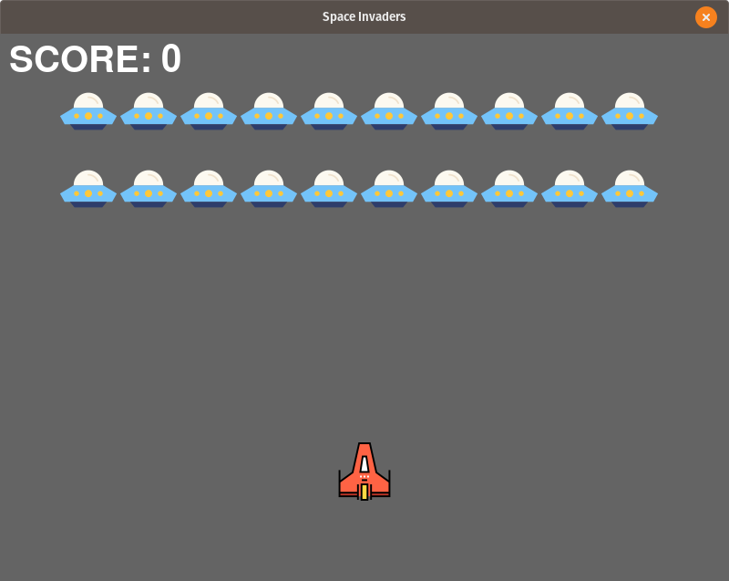

# Space-Invaders

My version of a space invaders game that I made using [pygame](https://www.pygame.org/news). The aim of making this game was to explore the pygame module and to implement it in an <b>Object Oriented Manner</b>. Each line of code is accompanied by a comment to explain it better.

### Files in the Repository - 
The files in the repository are :

#### README.md
The Description file containing details about the repository. The file that you looking at right now.

#### \_\_init__.py
The \_\_init__.py file is to make Python treat directories containing the file as packages

#### characters.py
This file contains the class templates for the various objects in the game i.e. `ObjectTemplate class, Enemy class, Player class and Bullet class`.

#### global_variables.py
This file contains the global variables that are used in the game such as `PAGE_WIDTH, PAGE_HEIGHT,` etc.

#### main.py
This file is contains the game and its working. To play the game, use -<br>

```bash
python3 main.py
```

#### requirements.txt
This file contains the respective packages needed to be installed. To install the respective packages, use -

```bash
pip3 install -r requirements.txt

or 

pip install -r requirements.txt
```  

#### images
This directory contains the images for game icon, object images and README File.

## Game Image -



## Bibliography
-  <b>Icons:</b> https://www.flaticon.com/
-  <b>Reference:</b> https://www.youtube.com/watch?v=FfWpgLFMI7w by [freeCodeCamp.org](https://www.youtube.com/channel/UC8butISFwT-Wl7EV0hUK0BQ). 

[]( https://github.com/shashank3199 )
=======
# Space-Invaders
My version of a space invaders game that I made using pygame. The aim of making this game was to explore the pygame module.